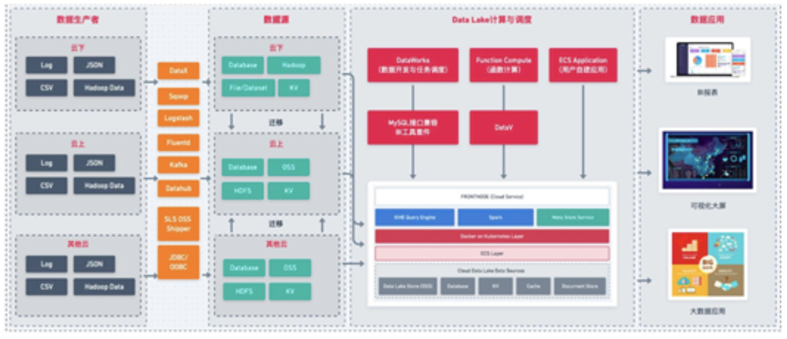
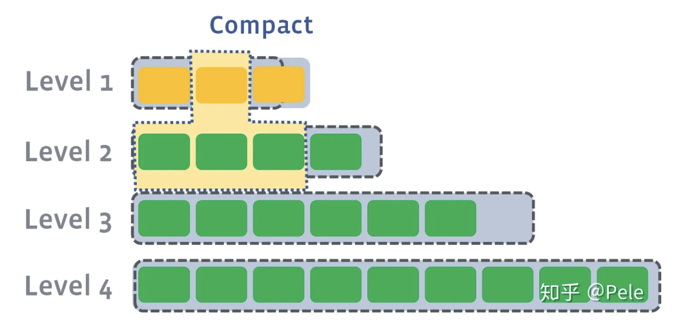

### **方向性的，技术调研类的学习，非针对某项技术的深度学习笔记。**

## bilibili 学习资源

学习打卡，加入大数据成神之路：
《Java基础入门》[av57762736](https://www.bilibili.com/video/av57762736/)
《Java基础提高》[av57779144](https://www.bilibili.com/video/av57779144/)
《Java并发编程》[av57885447](https://www.bilibili.com/video/av57885447/)
《锁的高级优化》[av57885572](https://www.bilibili.com/video/av57885572/)
《NIO、AIO教程》[av57742167](https://www.bilibili.com/video/av57742167/)
《数据结构和算法》[av57767500](https://www.bilibili.com/video/av57767500/)
《Java8新特性》[av57744721](https://www.bilibili.com/video/av57744721/)
《JavaEE基础班》[av57659690](https://www.bilibili.com/video/av57659690/)
《JVM从入门到精通》[av57886387](https://www.bilibili.com/video/av57886387/)
《Netty从入门到精通》[av57886700](https://www.bilibili.com/video/av57886700/)
《Linux常用基础》[av57886657](https://www.bilibili.com/video/av57886657/)
《Redis从入门到实战》[av57887614](https://www.bilibili.com/video/av57887614/)
《Zookeeper从入门打实战》[av57888546](https://www.bilibili.com/video/av57888546/)
《Hadoop入门教程》[av57762236](https://www.bilibili.com/video/av57762236/)
《传智播客黑马大数据实战》[av57558779](https://www.bilibili.com/video/av57558779/)
《传智播客黑马大数据实战》[av57621967](https://www.bilibili.com/video/av57621967/)
《传智播客黑马大数据实战》[av57622141](https://www.bilibili.com/video/av57622141/)
《传智播客黑马大数据实战》[av57622309](https://www.bilibili.com/video/av57622309/)
《Spark》[av57876796](https://www.bilibili.com/video/av57876796/)
《北风网spark》[av57541511](https://www.bilibili.com/video/av57541511/)
《elasticsearch从入门到实战》[av57779079](https://www.bilibili.com/video/av57779079/)
《极限大数据之推荐系统》[av57877736](https://www.bilibili.com/video/av57877736/)
《Hive》[av57765748](https://www.bilibili.com/video/av57765748/)
《Hbase》[av57767674](https://www.bilibili.com/video/av57767674/)

Java：[av59599696](https://www.bilibili.com/video/av59599696/)
MySQL：[av59623481](https://www.bilibili.com/video/av59623481/)
Spring Boot：[av59572480](https://www.bilibili.com/video/av59572480/)
Spring：[av59570922](https://www.bilibili.com/video/av59570922/)
Git：[av59634634](https://www.bilibili.com/video/av59634634/)
Javascript：Git
电商项目实战：[av59641879](https://www.bilibili.com/video/av59641879/)
Java 算法：[av59600020](https://www.bilibili.com/video/av59600020/)
Java 设计模式：[av59599696](https://www.bilibili.com/video/av59599696/)
Spring MVC：[av59567541](https://www.bilibili.com/video/av59567541/)
MyBatis：[av59564271](https://www.bilibili.com/video/av59564271/)
Vue 项目实战：[av59658277](https://www.bilibili.com/video/av59658277/)
HTML + CSS：[av59657634](https://www.bilibili.com/video/av59657634/)
Spring Cloud：[av59639535](https://www.bilibili.com/video/av59639535/)
Python 项目实战：[av59740677](https://www.bilibili.com/video/av59740677/)
Redis：[av59604203](https://www.bilibili.com/video/av59604203/)
Maven：[av59640042](https://www.bilibili.com/video/av59640042/)
Dubbo：[av59633511](https://www.bilibili.com/video/av59633511/)
Hadoop：[av59769574](https://www.bilibili.com/video/av59769574/)
Docker：[av59639711](https://www.bilibili.com/video/av59639711/)
C 语言：[av59628848](https://www.bilibili.com/video/av59628848/)
Vue 核心：[av59658020](https://www.bilibili.com/video/av59658020/)
Kubernetes：[av59642060](https://www.bilibili.com/video/av59642060/)
MongoDB：[av59604756](https://www.bilibili.com/video/av59604756/)
Kafka：[av59634004](https://www.bilibili.com/video/av59634004/)
Python 爬虫：[av59706997](https://www.bilibili.com/video/av59706997/)
Python 核心：[av59768359](https://www.bilibili.com/video/av59768359/)
React 项目实战：[av59709253](https://www.bilibili.com/video/av59709253/)
SSM 整合：[av59585780](https://www.bilibili.com/video/av59585780/)
Netty：[av59683486](https://www.bilibili.com/video/av59683486/)
Tensorflow：[av59746352](https://www.bilibili.com/video/av59746352/)
Elasticsearch：[av59628430](https://www.bilibili.com/video/av59628430/)
Oracle：[av59590533](https://www.bilibili.com/video/av59590533/)
Linux：[av59640439](https://www.bilibili.com/video/av59640439/)
前端面试：[av59639585](https://www.bilibili.com/video/av59639585/)

## 大数据平台CDH搭建

https://www.jianshu.com/p/106739236db4

## [数仓建设 | ODS、DWD、DWM等理论实战](https://zhuanlan.zhihu.com/p/502499238)

>往下就去研究数据技术吧，**数据湖，流批一体、存算分离** 啥的，往上就去做数据治理，再往上就得去搞业务，数据服务、数字化啥的，这三者都有光明的前途。
>
>
>
>
>
>## 三、何为数仓DW
>
>Data warehouse（可简写为DW或者DWH）数据仓库，是在数据库已经大量存在的情况下，它是**一整套包括了etl、调度、建模在内的完整的理论体系。** 数据仓库的方案建设的目的，是为前端查询和分析作为基础，主要应用于OLAP（on-line Analytical Processing），支持复杂的分析操作，侧重决策支持，并且提供直观易懂的查询结果。目前行业比较流行的有：AWS Redshift，Greenplum，Hive等。 数据仓库并不是数据的最终目的地，而是为数据最终的目的地做好准备，这些准备包含：清洗、转义、分类、重组、合并、拆分、统计等。
>
>## 六、数据集市
>
>数据集市就是企业级数据仓库的一个子集，它主要面向部门级业务，并且只面向某个特定的主题。
>
>理论上讲，应该有一个总的数据仓库的概念，然后才有数据集市。实际建设数据集市的时候，国内很少这么做。国内一般会先从数据集市入手，就某一个特定的主题（比如企业的客户信息）先做数据集市，再建设数据仓库。
>
>
>
>### 2. APP层干什么的？
>
>**问**：感觉DWS层是不是没地方放了，各个业务的DWS表是应该在 DWD还是在 app?
>
>**答**：**这个问题不太好回答，我感觉主要就是明确一下DWS层是干什么的，如果你的DWS层放的就是一些可以供业务方使用的宽表表，放在 app 层就行。如果你说的数据集市是一个比较泛一点的概念，那么其实 dws、dwd、app 这些合起来都算是数据集市的内容。**
>
>**问**：那存到 Redis、ES 中的数据算是 app 层吗?
>
>**答**：算是的，我个人的理解，**app 层主要存放一些相对成熟的表，能供业务侧使用的。**这些表可以在 Hive 中，也可以是从 Hive 导入 Redis 或者 ES 这种查询性能比较好的系统中。

##  “数据湖”：概念、特征、架构与案例 (详细，全名)

 https://developer.aliyun.com/article/761484#slide-0

>**简介：** 作者：惊玄
>
>## 四、各厂商的数据湖解决方案
>
>### 4.1 AWS数据湖解决方案
>
>
>
>上图自左向右，体现了数据流入、数据沉淀、数据计算、数据应用四个步骤。我们进一步来看其关键点：
>
>**1） 数据流入。**
>数据流入是整个数据湖构建的起始，包括**元数据的流入和业务数据流入**两个部分。元数据流入包括数据源创建、元数据抓取两步，最终会形成数据资源目录，并生成对应的安全设置与访问控制策略。
>
>业务数据的流入是通过ETL来完成的。
>
>**2） 数据沉淀。**
>
>采用Amazon S3作为整个数据湖的集中存储。
>
>**3） 数据计算。**
>
>**4） 数据应用。**
>
>在提供基本的批处理计算模式之外，AWS通过各类外部计算引擎，来提供丰富的计算模式支持，例如通过Athena/Redshift来提供基于SQL的交互式批处理能力；通过EMR来提供各类基于Spark的计算能力，包括Spark能提供的流计算能力和机器学习能力。
>
>**5） 权限管理。**
>
>AWS 的数据湖解决方案通过Lake Formation来提供相对完善的权限管理，粒度包括“库-表-列”。但是，有一点例外的是，GLUE访问Lake Formation时，粒度只有“库-表”两级；这也从另一个侧面说明，GLUE和Lake Formation的集成是更为紧密的，GLUE对于Lake Formation中的数据有更大的访问权限。
>
>### 4.3 阿里云数据湖解决方案
>
>
>
>**整个方案依然采用OSS作为数据湖的集中存储**。在数据源的支持上，目前也支持所有的阿里云数据库，包括OLTP、OLAP和NoSQL等各类数据库。核心关键点如下：
>
>1） 数据接入与搬迁。**在建湖过程中，DLA的Formation组件具备元数据发现和一键建湖的能力**，在本文写作之时，目前“一键建湖”还**只支持全量建湖，但是基于binlog的增量建湖已经在开发中了**，预计近期上线。增量建湖能力会极大的增加数据湖中数据的实时性，并将对源端业务数据库的压力降到最下。这里需要注意的是，DLA Formation是一个内部组件，对外并没有暴露。
>
>2） 数据资源目录。**DLA提供Meta data catalog组件对于数据湖中的数据资产进行统一的管理，**无论数据是在“湖中”还是在“湖外”。Meta data catalog也是联邦分析的统一元数据入口。
>
>3） 在内置计算引擎上，**DLA提供了SQL计算引擎和Spark计算引擎两种。**无论是SQL还是Spark引擎，都和Meta data catalog深度集成，能方便的获取元数据信息。基于Spark的能力，DLA解决方案支持批处理、流计算和机器学习等计算模式。
>
>4） 在外围生态上，除了支持各类异构数据源做数据接入与汇聚之外，在对外访问能力上，**DLA与云原生数据仓库（原ADB）深度整合。**一方面，DLA处理的结果可之际推送至ADB中，满足实时、交互式、ad hoc复杂查询；另一方面，ADB里的数据也可以借助外表功能，很方便的进行数据回流至OSS中。基于DLA，阿里云上各类异构数据源可以完全被打通，数据自由流动。
>
>5） 在**数据集成和开发**上，阿里云的数据湖解决方案提供两种选择：**一种是采用dataworks完成；另一种是采用DMS来完成。无论是选择哪种，都能对外提供可视化的流程编排、任务调度、任务管理能力。在数据生命周期管理上，dataworks的数据地图能力相对更加成熟。**
>
>6） 在数据管理和数据安全上，DMS提供了强大的能力。**DMS的数据管理粒度分为“库-表-列-行”，完善的支持企业级的数据安全管控需求。**除了权限管理之外，DMS更精细的地方是把原来基于数据库的devops理念扩展到了数据湖，使得数据湖的运维、开发更加精细化。
>
>
>
>阿里云的DLA解决方案的另一个特色在于“基于云原生的湖仓一体化”。传统的企业级数据仓库在大数据时代的今天，在各类报表应用上依然是无法替代的；但是数仓无法满足大数据时代的数据分析处理的灵活性需求；因此，我们推荐数据仓库应该作为数据湖的上层应用存在：即数据湖是原始业务数据在一个企业/组织中唯一官方数据存储地；**数据湖根据各类业务应用需求，将原始数据进行加工处理，形成可再次利用的中间结果；当中间结果的数据模式（Schema）相对固定后，DLA可以将中间结果推送至数据仓库，供企业/组织开展基于数仓的业务应用。**阿里云在提供DLA的同时，还提供了云原生数仓（原ADB），DLA和云原生数仓在以下两点上深度融合。
>1） **使用同源的SQL解析引擎。**DLA的SQL与ADB的SQL语法上完全兼容，这意味着开发者使用一套技术栈即能同时开发数据湖应用和数仓应用。
>2） **都内置了对于OSS的访问支持。**OSS直接作为DLA的原生存储存在；**对于ADB而言，可以通过外部表的能力，很方便的访问OSS上的结构化数据。借助外部表，数据可以自由的在DLA和ADB之间流转，做到真正的湖仓一体。**??
>
>DLA+ADB的组合真正做到了云原生的湖仓一体（关于什么是云原生，不在本文的讨论范畴）。本质上，DLA可以看成一个能力扩展的数据仓库贴源层。与传统数仓相比，该贴源层：**（1）可以保存各类结构化、半结构化和非结构化数据；（2）可以对接各类异构数据源；（3）具备元数据发现、管理、同步等能力；（4）内置的SQL/Spark计算引擎具备更强的数据处理能力，满足多样化的数据处理需求；（5）具备全量数据的全生命周期管理能力。基于DLA+ADB的湖仓一体化方案，将同时覆盖“大数据平台+数据仓库”的处理能力。**
>
>
>
>DLA还有一个重要能力是构建了一个“四通八达”的数据流动体系，并以数据库的体验对外提供能力，无论数据在云上还是云下，无论数据在组织内部还是外部；借助数据湖，各个系统之间的数据不再存在壁垒，可以自由的流进流出；更重要的是，这种流动是受监管的，数据湖完整的记录了数据的流动情况。
>
>

## 深度对比 Delta、Iceberg 和 Hudi 三大开源数据湖方案

https://www.infoq.cn/article/fjebconxd2sz9wloykfo

>在没有 Delta 数据湖之前，Databricks 的客户一般会采用经典的 **Lambda 架构**来构建他们的流批处理场景。以用户点击行为分析为例，点击事件经 Kafka 被下游的 Spark Streaming 作业消费，分析处理（业务层面聚合等）后得到一个实时的分析结果，这个实时结果只是当前时间所看到的一个状态，无法反应时间轴上的所有点击事件。所以为了保存全量点击行为，Kafka 还会被另外一个 Spark Batch 作业分析处理，**导入到文件系统上**（一般就是 parquet 格式写 HDFS 或者 S3，可以认为这个文件系统是一个简配版的数据湖），供下游的 Batch 作业做全量的数据分析以及 AI 处理等。
>
>这套方案其实存在很多问题  :
>
>第一、**批量导入到文件系统的数据一般都缺乏全局的严格 schema 规范**，下游的 Spark 作业做分析时碰到格式混乱的数据会很麻烦，每一个分析作业都要过滤处理错乱缺失的数据，成本较大；
>
>第二、**数据写入文件系统这个过程没有 ACID 保证**，用户可能读到导入中间状态的数据。所以上层的批处理作业为了躲开这个坑，只能调度避开数据导入时间段，可以想象这对业务方是多么不友好；同时也无法保证多次导入的快照版本，例如业务方想读最近 5 次导入的数据版本，其实是做不到的。
>
>第三、**用户无法高效 upsert/delete 历史数据，parquet 文件一旦写入 HDFS 文件，要想改数据，就只能全量重新写一份的数据，成本很高。**事实上，这种需求是广泛存在的，例如由于程序问题，导致错误地写入一些数据到文件系统，现在业务方想要把这些数据纠正过来；线上的 MySQL binlog 不断地导入 update/delete 增量更新到下游数据湖中；某些数据审查规范要求做强制数据删除，例如欧洲出台的 GDPR 隐私保护等等。
>
>第四、**频繁地数据导入会在文件系统上产生大量的小文件，导致文件系统不堪重负，尤其是 HDFS 这种对文件数有限制的文件系统。**
>
>所以，在 Databricks 看来，以下四个点是数据湖必备的。
>
>
>
>事实上,  Databricks 在设计 Delta 时，希望做到流批作业在数据层面做到进一步的统一（如下图）。业务数据经过 Kafka 导入到统一的数据湖中（无论批处理，还是流处理），上层业务可以借助各种分析引擎做进一步的商业报表分析、流式计算以及 AI 分析等等。
>
>
>
>所以，总结起来，我认为 Databricks 设计 Delta 时主要考虑实现以下核心功能特性：
>
>
>
>## Uber 和 Apache Hudi
>
>Uber 的业务场景主要为：将线上产生的行程订单数据，同步到一个统一的数据中心，然后供上层各个城市运营同事用来做分析和处理。在 2014 年的时候，Uber 的数据湖架构相对比较简单，业务日志经由 Kafka 同步到 S3 上，上层用 EMR 做数据分析；线上的关系型数据库以及 NoSQL 则会通过 ETL（ETL 任务也会拉去一些 Kakfa 同步到 S3 的数据）任务同步到闭源的 Vertica 分析型数据库，城市运营同学主要通过 Vertica SQL 实现数据聚合。当时也碰到数据格式混乱、系统扩展成本高（依赖收 Vertica 商业收费软件）、数据回填麻烦等问题。后续迁移到开源的 Hadoop 生态，解决了扩展性问题等问题，但依然碰到 Databricks 上述的一些问题，其中最核心的问题是无法快速 upsert 存量数据。
>
>Uber 的业务场景主要为：将线上产生的行程订单数据，同步到一个统一的数据中心，然后供上层各个城市运营同事用来做分析和处理。在 2014 年的时候，Uber 的数据湖架构相对比较简单，业务日志经由 Kafka 同步到 S3 上，上层用 EMR 做数据分析；线上的关系型数据库以及 NoSQL 则会通过 ETL（ETL 任务也会拉去一些 Kakfa 同步到 S3 的数据）任务同步到闭源的 Vertica 分析型数据库，城市运营同学主要通过 Vertica SQL 实现数据聚合。当时也碰到数据格式混乱、系统扩展成本高（依赖收 Vertica 商业收费软件）、数据回填麻烦等问题。后续迁移到开源的 Hadoop 生态，解决了扩展性问题等问题，但依然碰到 Databricks 上述的一些问题，其中**最核心的问题是无法快速 upsert 存量数据**。
>
>
>
>Uber 团队在 Hudi 上同时实现了 Copy On Write 和 Merge On Read 的两种数据格式，其中 Merge On Read 就是为了解决他们的 fast upsert 而设计的。简单来说，**就是每次把增量更新的数据都写入到一批独立的 delta 文件集，定期地通过 compaction 合并 delta 文件和存量的 data 文件。同时给上层分析引擎提供三种不同的读取视角：仅读取 delta 增量文件、仅读取 data 文件、合并读取 delta 和 data 文件。满足各种业务方对数据湖的流批数据分析需求。**
>
>最终，我们可以提炼出 Uber 的数据湖需求为如下图，这也正好是 Hudi 所侧重的核心特性。
>
>
>
>## Netflix 和 Apache Iceberg
>
>Netflix 的数据湖原先是借助 Hive 来构建，但发现 Hive 在设计上的诸多缺陷之后，开始转为自研 Iceberg，并最终演化成 Apache 下一个高度抽象通用的开源数据湖方案。Netflix 用内部的一个时序数据业务的案例来说明 Hive 的这些问题，采用 Hive 时按照时间字段做 partition，他们发现仅一个月会产生 2688 个 partition 和 270 万个数据文件。他们执行一个简单的 select 查询，发现仅在分区裁剪阶段就耗费数十分钟。
>
>
>
>他们发现 Hive 的元数据依赖一个外部的 MySQL 和 HDFS 文件系统，通过 MySQL 找到相关的 parition 之后，需要为每个 partition 去 HDFS 文件系统上按照分区做目录的 list 操作。在文件量大的情况下，这是一个非常耗时的操作。同时，由于**元数据分属 MySQL 和 HDFS 管理，写入操作本身的原子性难以保证。即使在开启 Hive ACID 情况下，仍有很多细小场景无法保证原子性。**另外，**Hive Metastore 没有文件级别的统计信息，这使得 filter 只能下推到 partition 级别，而无法下推到文件级别**，对上层分析性能损耗无可避免。最后，**Hive 对底层文件系统的复杂语义依赖**，使得数据湖难以构建在成本更低的 S3 上。
>
>于是，Netflix 为了解决这些痛点，设计了自己的轻量级数据湖 Iceberg。在设计之初，作者们将其定位为一个通用的数据湖项目，所以在实现上做了高度的抽象。虽然目前从功能上看不如前面两者丰富，但由于它牢固坚实的底层设计，一旦功能补齐，将成为一个非常有潜力的开源数据湖方案。
>
>总体来说，Netflix 设计 Iceberg 的核心诉求可以归纳为如下：
>
>
>
>
>
>我们可以把上述三个项目针对的痛点，放到一张图上来看。可以发现标红的功能点，基本上是一个好的数据湖方案应该去做到的功能点。
>
>
>
>这里主要解释下，对数据湖来说三种隔离分别代表的含义。
>
>1. Serialization 是说所有的 reader 和 writer 都必须串行执行；
>2. Write Serialization: 是说多个 writer 必须严格串行，reader 和 writer 之间则可以同时跑；
>3. Snapshot Isolation: 是说如果多个 writer 写的数据无交集，则可以并发执行；否则只能串行。Reader 和 writer 可以同时跑。
>
>综合起来看，Snapshot Isolation 隔离级别的并发性是相对比较好的。
>
>### 第二、Schema 变更支持和设计
>
>
>
>这里有两个对比项，一个是 schema 变更的支持情况，我的理解是 Hudi 仅支持添加可选列和删除列这种向后兼容的 DDL 操作，而其他方案则没有这个限制。另外一个是数据湖是否自定义 schema 接口，以期跟计算引擎的 schema 解耦。这里 Iceberg 是做的比较好的，抽象了自己的 schema，不绑定任何计算引擎层面的 schema。
>
>### 第三、流批接口支持
>
>
>
>目前 Iceberg 和 Hive 暂时不支持流式消费，不过 Iceberg 社区正在 issue 179 上开发支持。
>
>### 第四、接口抽象程度和插件化
>
>
>
>这里主要从**计算引擎的写入和读取路径、底层存储可插拔、文件格式四个方面来做对比。**
>
>Iceberg 是抽象程度做得最好的数据湖方案，四个方面都做了非常干净的解耦。**Delta 是 databricks 背后主推的，必须天然绑定 Spark；Hudi 的代码跟 Delta 类似，也是强绑定 Spark。存储可插拔的意思是说，是否方便迁移到其他分布式文件系统上（例如 S3）**，这**需要数据湖对文件系统 API 接口有最少的语义依赖，例如若数据湖的 ACID 强依赖文件系统 rename 接口原子性的话，就难以迁移到 S3 这样廉价存储上**，目前来看只有 Hive 没有太考虑这方面的设计；**文件格式指的是在不依赖数据湖工具的情况下，是否能读取和分析文件数据，这就要求数据湖不额外设计自己的文件格式**，统一用开源的 parquet 和 avro 等格式。这里，有一个好处就是，迁移的成本很低，不会被某一个数据湖方案给绑死。
>
>### 第五、查询性能优化
>
>
>
>### 第六、其他功能
>
>
>
>这里 One line demo 指的是，示例 demo 是否足够简单，体现了方案的易用性，Iceberg 稍微复杂一点（我认为主要是 Iceberg 自己抽象出了 schema，所以操作前需要定义好表的 schema）。做得最好的其实是 Delta，因为它深度跟随 Spark 易用性的脚步。
>
>Python 支持其实是很多基于数据湖之上做机器学习的开发者会考虑的问题，可以看到 Iceberg 和 Delta 是做的很好的两个方案。
>
>出于数据安全的考虑，Iceberg 还提供了文件级别的加密解密功能，这是其他方案未曾考虑到的一个比较重要的点。
>
>### 第七、社区现状（截止到 2020-01-08）
>
>
>
>这里需要说明的是，Delta 和 Hudi 两个项目在开源社区的建设和推动方面，做的比较好。Delta 的开源版和商业版本，提供了详细的内部设计文档，用户非常容易理解这个方案的内部设计和核心功能，同时 Databricks 还提供了大量对外分享的技术视频和演讲，甚至邀请了他们的企业用户来分享 Delta 的线上经验。Uber 的工程师也分享了大量 Hudi 的技术细节和内部方案落地，研究官网的近 10 个 PPT 已经能较为轻松理解内部细节，此外国内的小伙伴们也在积极地推动社区建设，提供了官方的技术公众号和邮件列表周报。Iceberg 相对会平静一些，社区的大部分讨论都在 Github 的 issues 和 pull request 上，邮件列表的讨论会少一点，很多有价值的技术文档要仔细跟踪 issues 和 PR 才能看到，这也许跟社区核心开发者的风格有关。
>
>
>
>这里需要说明的是，**Delta 和 Hudi 两个项目在开源社区的建设和推动方面，**做的比较好。Delta 的开源版和商业版本，提供了详细的内部设计文档，用户非常容易理解这个方案的内部设计和核心功能，同时 Databricks 还提供了大量对外分享的技术视频和演讲，甚至邀请了他们的企业用户来分享 Delta 的线上经验。**Uber 的工程师也分享了大量 Hudi 的技术细节和内部方案落地，研究官网的近 10 个 PPT 已经能较为轻松理解内部细节，此外国内的小伙伴们也在积极地推动社区建设，提供了官方的技术公众号和邮件列表周报。Iceberg 相对会平静一些，社区的大部分讨论都在 Github 的 issues 和 pull request 上，邮件列表的讨论会少一点，很多有价值的技术文档要仔细跟踪 issues 和 PR 才能看到，这也许跟社区核心开发者的风格有关。**
>
>## 总结
>
>我们把三个产品（其中 Delta 分为 databricks 的开源版和商业版）总结成如下图：
>
>
>
>如果用一个比喻来说明 Delta、Iceberg、Hudi、Hive-ACID 四者差异的话，可以把四个项目比做建房子。由于开源的 Delta 是 Databricks 闭源 Delta 的一个简化版本，它主要为用户提供一个 table format 的技术标准，闭源版本的 Delta 基于这个标准实现了诸多优化，这里我们主要用闭源的 Delta 来做对比。
>
>
>
>Delta 的房子底座相对结实，功能楼层也建得相对比较高，但这个房子其实可以说是 Databricks 的，本质上是为了更好的壮大 Spark 生态，在 Delta 上其他的计算引擎难以替换 Spark 的位置，尤其是写入路径层面；Iceberg 的建筑基础非常扎实，扩展到新的计算引擎或者文件系统都非常的方便，但是现在功能楼层相对低一点，目前最缺的功能就是 upsert 和 compaction 两个，Iceberg 社区正在以最高优先级推动这两个功能的实现；Hudi 的情况要相对不一样，它的建筑基础设计不如 iceberg 结实，举个例子，如果要接入 Flink 作为 Sink 的话，需要把整个房子从底向上翻一遍，把接口抽象出来，同时还要考虑不影响其他功能，当然 Hudi 的功能楼层还是比较完善的，提供的 upsert 和 compaction 功能直接命中广大群众的痛点。Hive 的房子，看起来是一栋豪宅，绝大部分功能都有，把它做为数据湖有点像靠着豪宅的一堵墙建房子，显得相对重量级一点，另外正如 Netflix 上述的分析，细看这个豪宅的墙面是其实是有一些问题的。

## Flink Table Store ——从计算到存储提升流批统一端到端用户体验

https://blog.csdn.net/tzs_1041218129/article/details/124743262

https://nightlies.apache.org/flink/flink-table-store-docs-stable/

Flink Table Store 和 flink + iceberg 的对比，

>

## LSM树详解

Flink Table Store  文件存储使用LSM组织.

学习下这个 数据结构。

>## **1、LSM树的核心思想**
>
>
>
>如上图所示，LSM 树有以下三个重要组成部分：
>
>***1) MemTable***
>
>MemTable是在**内存**中的数据结构，用于**保存最近更新的数据，会按照Key有序地组织这些数据**，**LSM树对于具体如何组织有序地组织数据并没有明确的数据结构定义**，例如Hbase使跳跃表来保证内存中key的有序。
>
>因为数据暂时保存在内存中，内存并不是可靠存储，如果断电会丢失数据，因此通常会通过**WAL(Write-ahead logging，预写式日志)**的方式来保证数据的可靠性。
>
>***2) Immutable MemTable***
>
>当 MemTable达到一定大小后，会转化成Immutable MemTable。**Immutable MemTable是将转MemTable变为SSTable的一种中间状态。写操作由新的MemTable处理，在转存过程中不阻塞数据更新操作。**
>
>***3) SSTable(Sorted String Table)***
>
>**有序键值对集合，是LSM树组在磁盘中的数据结构。**为了加快SSTable的读取，可以通过建立key的索引以及布隆过滤器来加快key的查找。
>
>
>
>这里需要关注一个重点，**LSM树(Log-Structured-Merge-Tree)正如它的名字一样，LSM树会将所有的数据插入、修改、删除等操作记录(注意是操作记录)保存在内存之中，当此类操作达到一定的数据量后，再批量地顺序写入到磁盘当中。**这与B+树不同，B+树数据的更新会直接在原数据所在处修改对应的值，但是**LSM数的数据更新是日志式的，当一条数据更新是直接append一条更新记录完成的。这样设计的目的就是为了顺序写，不断地将Immutable MemTable flush到持久化存储即可，而不用去修改之前的SSTable中的key，保证了顺序写。**
>
>因此当**MemTable达到一定大小flush到持久化存储变成SSTable后，在不同的SSTable中，可能存在相同Key的记录，当然最新的那条记录才是准确的。这样设计的虽然大大提高了写性能，但同时也会带来一些问题：**
>
>> 1）**冗余存储，对于某个key，实际上除了最新的那条记录外，其他的记录都是冗余无用的，但是仍然占用了存储空间。因此需要进行Compact操作(合并多个SSTable)来清除冗余的记录。**
>> 2）**读取时需要从最新的倒着查询，直到找到某个key的记录。最坏情况需要查询完所有的SSTable，这里可以通过前面提到的索引/布隆过滤器来优化查找速度。**
>
>## 2、LSM树的Compact策略
>
>从上面可以看出，Compact 操作是十分关键的操作，否则SSTable数量会不断膨胀。在Compact策略上，主要介绍两种基本策略：**size-tiered 和 leveled。**
>
>不过在介绍这两种策略之前，先介绍三个比较重要的概念，事实上不同的策略就是围绕这三个概念之间做出权衡和取舍。
>
>> 1）读放大:读取数据时实际读取的数据量大于真正的数据量。**例如在LSM树中需要先在MemTable查看当前key是否存在，不存在继续从SSTable中寻找。**
>> 2）写放大:**写入数据时实际写入的数据量大于真正的数据量。例如在LSM树中写入时可能触发Compact操作，导致实际写入的数据量远大于该key的数据量。**
>> 3）空间放大:**数据实际占用的磁盘空间比数据的真正大更多。上面提到的冗余存储，对于一个key来说，只有最新的那条记录是有效的，而之前的记录都是可以被清理回收的。**
>
>***1) size-tiered 策略***
>
>
>
>size-tiered策略保证每层SSTable的大小相近，同时限制每一层SSTable的数量。如上图，每层限制SSTable为N，当每层SSTable达到N后，则触发Compact操作合并这些SSTable，并将合并后的结果写入到下一层成为一个更大的sstable。
>
>由此可以看出，当层数达到一定数量时，最底层的单个SSTable的大小会变得非常大*。并且*size-tiered策略会导致空间放大比较严重*。**即使对于同一层的SSTable，每个key的记录是可能存在多份的，只有当该层的SSTable执行compact操作才会消除这些key的冗余记录。**
>
>***2) leveled策略***
>
>
>
>leveled策略也是采用分层的思想，每一层限制总文件的大小。
>
>但是跟size-tiered策略不同的是，leveled会将每一层切分成多个大小相近的SSTable。这些SSTable是这一层是**全局有序**的，意味着一个key在每一层至多只有1条记录，不存在冗余记录。之所以可以保证全局有序，是因为合并策略和size-tiered不同，接下来会详细提到。
>
>
>
>假设存在以下这样的场景:
>
>1) L1的总大小超过L1本身大小限制：
>
>
>
>2) 此时会从L1中选择至少一个文件，然后把它跟L2***有交集的部分(非常关键)***进行合并。生成的文件会放在L2:
>
>
>
>如上图所示，**此时L1第二SSTable的key的范围覆盖了L2中前三个SSTable，那么就需要将L1中第二个SSTable与L2中前三个SSTable执行Compact操作。**
>
>3) 如果L2合并后的结果仍旧超出L5的阈值大小，需要重复之前的操作 —— 选至少一个文件然后把它合并到下一层:
>
>
>
>需要注意的是，***多个不相干的合并是可以并发进行的\***：
>
>
>
>leveled策略相较于size-tiered策略来说，每层内key是不会重复的，即使是最坏的情况，除开最底层外，其余层都是重复key，按照相邻层大小比例为10来算，冗余占比也很小。因此空间放大问题得到缓解。但是写放大问题会更加突出。举一个最坏场景，如果LevelN层某个SSTable的key的范围跨度非常大，覆盖了LevelN+1层所有key的范围，那么进行Compact时将涉及LevelN+1层的全部数据。
>
>## 3、总结
>
>LSM树是非常值得了解的知识，理解了LSM树可以很自然地理解Hbase，LevelDb等存储组件的架构设计。ClickHouse中的MergeTree也是LSM树的思想，Log-Structured还可以联想到Kafka的存储方式。
>
>虽然介绍了上面两种策略，但是各个存储都在自己的Compact策略上面做了很多特定的优化，例如Hbase分为Major和Minor两种Compact，这里不再做过多介绍，推荐阅读文末的RocksDb合并策略介绍。
>
>PS:封面是在当时百度搜索lsm树的截图，真实截图，非PS。

## 作业帮基于 DeltaLake 的数据湖建设最佳实践

https://developer.aliyun.com/article/854727?utm_content=m_1000320972

https://blog.csdn.net/weixin_43970890/article/details/122721112

># **二、问题&痛点**
>
>作业帮离线数仓基于 Hive 提供从 ODS 层到 ADS 层的数据构建能力，当 ADS 表生成后，会通过数据集成写入 OLAP 系统面向管理人员提供 BI 服务；此外，DWD、DWS、ADS 表，也会面向分析师提供线下的数据探查以及取数服务。
>
>随着业务逐步发展以及对应的数据量越来越多，离线数仓系统突显如下主要问题：
>
>- **ADS 表产出延迟越来越长**
>
>由于数据量增多，从 ODS 层到 ADS 层的全链路构建时间越来越长。虽然对于非常核心的 ADS 表链路可以通过倾斜资源的模式来短期解决，但是其实这个本质上就是丢车保帅的模式，该模式无法规模化复制，影响了其他重要的 ADS 表的及时产出，如对于分析师来说，由于数据表的延迟，对于T+1的表最差需等到T+2才可以看到。
>
>- **小时级表需求难以承接**
>
>有些场景是小时级产出的表，如部分活动需要小时级反馈来及时调整运营策略。对于这类场景，随着数据量增多、计算集群的资源紧张，小时级表很多时候难以保障及时性，而为了提高计算性能，往往需要提前预备足够的资源来做，尤其是需要小时级计算天级数据的时候，最差情况下计算资源需要扩大24倍。
>
>- **数据探查慢、取数稳定性差**
>
>数据产出后很多时候是面向分析师使用的，**直接访问 Hive 则需要几十分钟甚至小时级，完全不能接受**，经常会收到用户的吐槽反馈，而**采用 Presto 来加速 Hive 表的查询，由于 Presto 的架构特点，导致查询的数据表不能太大、逻辑不能太复杂，否则会导致 Presto 内存 OOM**，且 Hive 已有的 UDF 和 VIEW 等在 Presto 中也没法直接使用，这也非常限制分析师的使用场景。
>
>## 方案调研
>
>从上面分析来看，如果可以解决离线数仓的数据增量更新问题就可以提高链路计算的性能，而对于数据表支持索引能力，就可以在保障查询功能不降级的前提下降低查询的延迟。
>
>- **基于 HBase+ORC 的解决方案**
>
>解决数据的更新问题，可以采用 HBase 来做。对 RowKey 设置为主键，对各列设置为 Column，这样就可以提供数据实时写入的能力。但是受限于 HBase 的架构，**对于非主键列的查询性能则非常差**。为了解决其查询性能，需要定期（如小时表则小时级、天级表则天级）将 **HBase 的表按照特定字段排序后导出到 HDFS 并存储为 ORC 格式**，但是 ORC 格式只支持单列的 min、max 索引，**查询性能依然无法满足需求，且由于 HBase 的数据写入一直在持续发生，导出的时机难以控制**，在导出过程中数据还可能发生变化，如我们希望导出12月11日21点前的数据作为数据表21点分区的数据就需要考虑版本数、存储容量、筛选带来的计算性能等因素，系统复杂度陡增，同时也**引入了 HBase 系统增加了运维成本**。
>
>- **数据湖**
>
>数据湖实际上是一种数据格式，可以集成在主流的计算引擎（如 Flink/Spark）和数据存储(如对象存储)中间，不引入额外的服务，同时支持实时 Upsert，提供了多版本支持，可以读取任意版本的数据。
>
>数据湖实际上是一种数据格式，可以集成在主流的计算引擎（如 Flink/Spark）和数据存储(如对象存储)中间，不引入额外的服务，同时支持实时 Upsert，提供了多版本支持，可以读取任意版本的数据。
>
>目前数据湖方案主要有 DeltaLake、Iceberg、Hudi。 我们调研了阿里云上这三种方案，其区别和特点如下：
>
>
>
>此外，考虑到易用性（DeltaLake 语义清晰，阿里云提供全功能 SQL 语法支持，使用简单；后两者的使用门槛较高）、功能性（仅 DeltaLake 支持 Zorder/Dataskipping 查询加速）等方面，结合我们的场景综合考虑，我们最后选择 DeltaLake 作为数据湖解决方案。
>
># 四、基于 DeltaLake 的离线数仓
>
>
>
>首先 Binlog 通过 Canal 采集后经过我们自研的数据分发系统写入 Kafka，这里需要提前说明的是，我们的分发系统需要对 Binlog 按照 Table 级严格保序，原因下面详述。**其后使用 Spark 将数据分批写入 DeltaLake。最后我们升级了数据取数平台，使用 Spark SQL 从 DeltaLake 中进行取数。**
>
>在使用 DeltaLake 的过程中，我们需要解决如下关键技术点：
>
>## 流数据转批
>
>业务场景下，对于离线数仓的 ETL 任务，均是按照数据表分区就绪来触发的，如2021-12-31日的任务会依赖2021-12-30日的数据表分区就绪后方可触发运行。这个场景在 Hive 的系统上是很容易支持的，因为 Hive 天然支持按照日期字段（如dt）进行分区。但是对于 DeltaLake 来说，我们数据写入是流式写入的，因此就需要将流数据转为批数据，即某天数据完全就绪后，方可对外提供对应天级分区的读取能力。
>
>**如何界定数据完全就绪**
>
>流式数据一般会有乱序的情况，在乱序的情况下，即使采用 watermark 的机制，也只能保障一定时间范围内的数据有序，而对于离线数仓来说，数据需要100%可靠不丢。而如果我们可以解决数据源的有序性问题，那么数据就绪问题的解决就会简化很多：假如数据按照天级分区，那么当出现12-31的数据时，就可以认为12-30的数据都就绪了。
>
>因此，我们的方案拆解为两个子问题：
>
>- **流数据有序后界定批数据边界**
>- **保障流数据有序的机制**
>
>首先对于前者，总体方案如下：
>
>
>
>设定数据表的逻辑分区字段 dt 以及对应的时间单位信息。
>
>
>
>当 Spark 读取某一个 batch 数据后，根据上述表元数据使用数据中的 **event time 生成对应的 dt 值，如数据流中 event time 的值均属于T+1，则会触发生成数据版本T的 snapshot，数据读取时根据 snapshot 找到对应的数据版本信息进行读取**。
>
>**如何解决流数据的乱序问题**
>
>不论是 app-log 还是 MySQL-Binlog，对于日志本身都是有序的，以 MySQL-Binlog 举例，单个物理表的 Binlog 必然有序，但是实际业务场景下，业务系统会经常进行分库分表的使用，对于使用分表的场景，一张逻辑表 Table 会分为 Table1、Table2、……几张表，对于离线数仓的 ODS 表，则需要**屏蔽掉业务侧 MySQL 分表的细节和逻辑**，这样，问题就聚焦为如何解决分表场景下数据有序的问题。
>
>- 保障分库分表，甚至不同分表在不同集群的情况下，**数据写入到 Kafka 后的有序性。**即写入 DeltaLake 的 Spark 从某个 topic 读取到逻辑表的数据是 partition 粒度有序的。
>- 保障 **ODS 表就绪的时效性**，如区分无 Binlog 数据的情况下，ODS 层数据也可以按期就绪。
>
>
>
>如上图所示：某个 MySQL 集群的 Binlog 经 Canal 采集后写入到特定的 Kafka-topic，但是由于写入时按照**db和 Table（去分表_*后缀）做 hash 确定 partition，因此单个 partition 内部会存在多个物理表的 Binlog**，对于写入 DeltaLake 来说非常不友好。考虑到对其他数据应用方的兼容性，我们新增了**数据分发服务**：
>
>- **将逻辑表名（去分表_*后缀）的数据写入到对应的 topic，并使用物理表名进行 hash。保障单 partition 内部数据始终有序，单 topic 内仅包括一张逻辑表的数据。**
>- 在 MySQL 集群内**构建了内部的心跳表，来做 Canal 采集的延迟异常监控，并基于此功能设置一定的阈值来判断当系统没有 Binlog 数据时是系统出问题了还是真的没数据了。如果是后者，也会触发 DeltaLake 进行 savepoint，进而及时触发 snapshot来保障 ODS 表的及时就绪。**
>
>通过上述方案，我们将 Binlog 数据流式的写入 DeltaLake 中，且表分区就绪时间延迟<10mins。
>
>## 读写性能优化
>
>下面讲下我们在使用 **DeltaLake** 过程中遇到的性能问题以及对应的解法。
>
>**通过 DPP 提高写性能**
>
>DeltaLake 支持通过 **SparkStreamingSQL** 的方式来写入数据。
>
>因为要做记录的合并去重，因此这里需要通过 merge into 的方式写入。DeltaLake 更新数据时分为两步：
>
>- 定位到要更新的文件，默认情况下需要读取全部的文件和 Spark 内 batch 的增量数据做 Join，关联出需要更新的文件来。  
>- Merge 后重新写入这些文件，把老的文件标记为删除。
>
>
>
>如上左图所示，由于 DeltaLake 默认会读取上个版本的全量文件，因此导致写入性能极低，一次合并操作无法在 Spark一个 batch 内完成。
>
>针对这种场景，对 DeltaLake 做了升级：使用 **DPP 做分区剪枝来优化 Megre into 的性能**，如上右图所示：
>
>- **分析 Merge-on 条件，得到 source 表中对应到 DeltaLake 表分区字段的字段。**
>- **统计得到分区字段的枚举列表。**
>- **将上步结果转化成 Filter 对象并应用，进一步过滤裁剪数据文件列表。**
>- **读取最终的数据文件列表和 batch 的 source 数据关联得到最终需更新的文件列表。**
>
>通过 DPP 优化后，Spark 一个 batch（5min粒度）的处理延迟由**最大20mins+ 减少到 最大~3mins，**完全消除了过去因为处理时间过长导致延迟不断叠加的问题。
>
>**使用 Zorder 提高读性能**
>
>在解决了数据的写入性能后，我们又遇到了数据读取性能的问题。
>
>我们使用同样的数据（200亿+），使用 Hive 计算，平均延迟10min+，而使用 DeltaLake 后，平均延迟居然高达~11mins+。分析后发现主要是没有对筛选列使用 Zorder 排序，当开启 Zorder 后，延迟则降低到了~24s，**提高了近25X性****能。
>
>基于 Zorder 对 DeltaLake 表进行查询优化，主要会涉及两个方面的提升：
>
>- **Dataskipping**
>
>- - DeltaLake 会按照文件粒度统计各个字段的 max/min 值，用于直接过滤数据文件。
>
>- **Zorder**
>
>- - 一种数据 layout 的方式，可以**对数据重排列尽可能保证 Zorder 字段的数据局部性**。
>
>**Zorder 构建耗时优化**
>
>对哪些列开启 Zorder 是按需构建的，常规情况构建时长~30mins，数据倾斜下，构建Zorder 时长高达~90mins。
>
>针对这两种情况，对 Zorder 进行了优化：
>
>- 常规情况下，对于多列的 Zorder，由多次遍历数据集改为遍历一次数据集来提升构建效率。构建时长**从平均~30mins降低到~20mins。**
>- 数据倾斜下，对于倾斜列所在的 bucket 做了热点分散，构建时长**从平均~90mins降低到~30mins。**

## 数据库 - change data capture(CDC)

https://www.jianshu.com/p/cff8758896e9

>**如果源数据量很大，则抽取变化的源数据，这种数据抽取模式叫做变化数据捕获，简称CDC。**
>
>**CDC大体分为两种：侵入式和非侵入式。侵入式指CDC操作会给源系统带来性能影响，只要CDC操作以任何一种方式对源数据库执行了SQL操作，就认为是侵入式的。**
>
>常用的4种CDC方法是：**基于时间戳的CDC、基于触发器的CDC、基于快照的CDC** 和 **基于日志的CDC**，其中前三种是侵入式的。
>
>##### 基于时间戳的CDC
>
>抽取过程可以根据某些属性列来判断哪些数据是增量的，最常见的属性列有以下两种：
>
>- 时间戳：最好有两个列，一个插入时间戳，表示何时创建，一个更新时间戳，表示最后一次更新的时间。
>- 序列：大多数数据库都提供自增功能，如果数据库表列被定义成自增的，就可以很容易地根据该列识别新插入的数据。
>
>这种方法是最简单且常用的，但是有如下缺点：
>
>- 不能记录删除记录的操作
>- 无法识别多次更新
>- 不具有实时能力
>
>##### 基于触发器的CDC
>
>当执行 INSERT、UPDATE、DELETE这些SQL语句时，可以激活数据库里的触发器，并执行一些动作，就是说触发器可以用来捕获变更的数据并把数据保存在中间临时表里。然后这些变更数据再从临时表取出，抽取到数据仓库的过渡区中。大多数场合下，不允许向操作型数据库里添加触发器，且这种方法会降低系统性能，所以用的不多。
> 可以使用源数据库的复制功能，将源库的数据备用到备用库上，在备库上创建触发器。
> 有关于这种方法，我们将结合 HANA 数据库在下面进行详细阐述和举例。
>
>##### 基于快照的CDC
>
>如果没有时间戳，不允许使用触发器，就要使用快照表。可以通过比较源表和快照表来获得数据变化。
> 基于快照的 CDC 可以检测到插入、更新和删除的数据，这是相对于基于时间戳的CDC方案的有点。其缺点是需要大量存储空间来保存快照。
>
>##### 基于日志的CDC
>
>最复杂的和没有侵入性的CDC方法是基于日志的方式。数据库会把每个插入、更新、删除操作记录到日志里。
>
>

## Apache Parquet列式存储格式介绍

https://waylau.com/about-apache-parquet/

>在面向列的系统在运行中是否会更高效，在很大程度上取决于自动化的工作负载。检索给定对象（整行）的所有数据的操作较慢。面向行的系统可以在单个磁盘读取中检索行，而从列式数据库中收集数据需要进行大量磁盘操作。然而，这些整行操作通常很少见。在大多数情况下，仅检索有限的数据子集。例如，在通讯录应用程序中，从许多行中收集名字以构建联系人列表比读取所有数据要常见得多。这对于将数据写入数据库更加正确，特别是如果数据往往是“稀疏”的，有许多可选列。因此，尽管有许多理论上的缺点，但列存储还是表现出了出色的现实性能。
>
>## Parquet产生背景
>
>Parquet的灵感来自于2010年Google发表的Dremel论文（Dremel: Interactive Analysis of Web-Scale Datasets），文中介绍了一种支持嵌套结构的存储格式，并且使用了列式存储的方式提升查询性能，在Dremel论文中还介绍了Google如何使用这种存储格式实现并行查询的，如果对此感兴趣可以参考该论文和开源实现Apache Drill（https://drill.apache.org/）。
>
>## Parquet文件格式
>
>**Parquet 文件是以二进制方式存储的，所以是不可以直接读取的，文件中包括该文件的数据和元数据，因此Parquet格式文件是自解析的。在HDFS文件系统和Parquet文件中存在如下几个概念。**
>
>- **HDFS块(Block)：它是HDFS上的最小的副本单位，HDFS会把一个Block存储在本地的一个文件并且维护分散在不同的机器上的多个副本，通常情况下一个Block的大小为256M、512M等。**
>- **HDFS文件(File)：一个HDFS的文件，包括数据和元数据，数据分散存储在多个Block中。**
>- **行组(Row Group)：按照行将数据物理上划分为多个单元，每一个行组包含一定的行数，在一个HDFS文件中至少存储一个行组，Parquet 读写的时候会将整个行组缓存在内存中，所以如果每一个行组的大小是由内存大的小决定的，例如记录占用空间比较小的Schema可以在每一个行组中存储更多的行。**
>- **列块(Column Chunk)：在一个行组中每一列保存在一个列块中，行组中的所有列连续的存储在这个行组文件中。一个列块中的值都是相同类型的，不同的列块可能使用不同的算法进行压缩。**
>- **页(Page)：每一个列块划分为多个页，一个页是最小的编码的单位，在同一个列块的不同页可能使用不同的编码方式。**
>
>一个Parquet文件的内容由Header、Data Block和Footer三部分组成。在文件的首尾各有一个内容为PAR1的Magic Number，用于标识这个文件为Parquet文件。Header部分就是开头的Magic Number。
>
>Data Block是具体存放数据的区域，由多个Row Group组成，每个Row Group包含了一批数据。比如，假设一个文件有1000行数据，按照相应大小切分成了两个Row Group，每个拥有500行数据。每个Row Group中，数据按列汇集存放，每列的所有数据组合成一个Column Chunk。因此一个Row Group由多个Column Chunk组成，Column Chunk的个数等于列数。每个Column Chunk中，数据按照Page为最小单元来存储，根据内容分为Data Page和Dictionary Page。这样逐层设计的目的在于：
>
>- 多个Row Group可以实现数据的并行加载
>- 不同Column Chunk用来实现列存储
>- 进一步分割成Page，可以实现更细粒度的数据访问
>
>Footer部分由File Metadata、Footer Length和Magic Number三部分组成。Footer Length是一个4字节的数据，用于标识Footer部分的大小，帮助找到Footer的起始指针位置。Magic Number同样是PAR1。File Metada包含了非常重要的信息，包括Schema和每个Row Group的Metadata。每个Row Group的Metadata又由各个Column的Metadata组成，每个Column Metadata包含了其Encoding、Offset、Statistic信息等等。
>
>
>
>通常情况下，在存储Parquet数据的时候会**按照Block大小设置行组的大小**，由于一般情况下每一个Mapper任务处理数据的最小单位是一个Block，这样可以把每一个行组由一个Mapper任务处理，增大任务执行并行度。Parquet文件的格式如下图所示。

## 第1章02节 | Presto概述：特性、原理、架构

https://zhuanlan.zhihu.com/p/260399749

>企业中常见的数据计算需求，如**BI报表，Ad-Hoc查询，甚至是运行时间比较长的ETL任务，Presto都是支持的，不过目前来说，笔者所知和所用的Presto应用场景中，主要还是查询时延要求在毫秒或者秒级别的SQL并发BI报表，Ad-Hoc查询以及多数据源关联查询居多，用Presto来做ETL工具的不多，毕竟Spark，Flink这些成熟的流批计算工具，用作ETL工具相对更成熟一些。**
>
>
>
>
>
>- **Coordinator**，**负责接收 SQL Query，解析SQL，生成和优化执行计划，生成和调度Task到Worker上。Coordinator将一个完整的 Query，拆分成了多个Stage，每个Stage拆分出多个可以并行的Task。**
>- **Worker**，负责执行 Coordinator发给它的Task，有部分Task负责到外部存储系统拉取数据，这部分Task会先执行，之后再执行那些负责计算的Task。从上图中可以看到，拉取数据的Task是在右侧两个Worker上执行的，负责计算的Task是在左侧一个Worker上执行的。
>
>**Worker 是可以横向扩容多个来支撑更多的计算需求的，Coordinator 只能有一个，由此我们可以得出结论，Coordinator是单点，在集群可用性上有一定的风险**，至于这个问题如何解决，请你仔细阅读本专栏后面的章节，会详细的讲到。
>
>**Presto 的架构实际上就是一套分布式的SQL执行架构，它最大的特点就是天然就是存储计算分离，Presto只负责计算，存储的部分由数据源自身提供。**这种存储与计算分离的架构很符合当今云计算发展的趋势——独立的存储云服务与计算云服务，这样做的好处是存储资源不够时可以独立扩容存储，计算资源不够时可以独立扩容计算，而且计算和存储能够分别使用适合自己的机型。**分布式的存储系统的实现一般都比较复杂，涉及到数据的分区、副本、容灾、文件格式、IO优化等，是一项非常大的工程。Presto直接放弃了存储，只做计算，而且它的计算也是做了一些妥协的，如不支持单个Query内部的执行容错，如果Query中的某个Task失败了，会导致整个Query失败。这样实现起来更简单，代价是需要用户侧来重试。**
>
>本质上，你可以这么理解 Presto 是由以下几个部分组成的：
>
>**第一部分：一个高性能、分布式的SQL执行框架**
>
>SQL 是一种声明式的编程语言，能够很清晰的表达用户想要什么，正是因为它学习难度比较低、易用性比较高，已经成为数据库和大数据计算领域最常用的业务计算逻辑编写的方式。然而，在生产环境中，**有很多系统没有对外暴露SQL执行接口，对内也没有SQL执行能力，如Elasticsearch和HBase；而有些系统虽然有SQL接口，但是没有海量数据计算能力，如MySQL；还有另外一些系统用MapReduce完成SQL计算，时延太长不满足业务需求，如Hive。Presto 这个SQL执行框架主要解决的问题是为这些数据源提供了一种通用统一的SQL执行能力，在海量数据规模下，还具备了高性能、分布式的计算能力。一个SQL Query进入到Presto系统中，分别完成了以下几个关键步骤，最终将结果输出：**
>
>- **第一步：接收 SQL Query 请求**
>- **第二步：SQL 解析、语义分析（生成AST）**
>- **第三步：生成执行计划、优化执行计划**
>- **第四步：划分Stage、生成和调度Task**
>- **第五步：在 Presto Worker 上执行Task（有从数据源拉取数据的Task，也有计算为主的Task），生成结果**
>- **第六步：分批返回Query结果给客户端**
>
>有了 Presto 以后，它为用户屏蔽了SQL解析之行的底层细节，**并尽它所能在查询延迟、并行度、数据本地性、根据规则或成本选择最优执行计划上做了非常多的优化。**
>
>**第二部分：一套插件化体系，包含数据源Connector和自定义执行逻辑的SQL functions**
>
>**简单的说，借助Connector机制，Presto 可以将来自一切数据源的数据计算SQL化，无论用户的数据源是本地文件(File Connector)、内存（Memory Connector）、HTTP API（Http Connector），还是Hive（Hive Connector）、HBase（HBase Connector）、MySQL（MySQL Connector）。**
>
>通过提供 Connector 机制，Presto 实现了完全插件化的数据源的元数据获取、注册、数据读取，不同的数据源对于Presto来说就是不同的Connector，用户操作数据源是通过Connector来操作的，同时它本身就自带了多个可以直接使用的数据源Connector，如Hive Connector，Kafka Connector，Elasticsearch Connector，MySQL Connector。举个例子，**用户可以使用Presto的Hive Connector来查看Hive中都有哪些表，表结构是什么，也可以写SQL查询Hive中的数据，还可以把数据写到Hive。这个场景中，用Presto执行SQL与直接执行Hive SQL的区别是，Presto SQL的底层SQL执行引擎并不是Hive SQL，而是自行实现的一套MPP执行架构，实际执行SQL的时候，无论是Query的调度、执行计划的生成，还是执行任务的生成和执行，其速度都是Hive SQL的5-10倍（行业内有相关的性能对比测试报告）。**众所周知，**Hive SQL底层是使用Hadoop MapReduce 执行模型实现的，而且Query的调度和执行都是通过启动新的JVM来完成，它更适合去处理数据量超大而且对处理延迟要求比较低（一般是小时，天级别）的数据计算任务，如果是BI报表，Ad-hoc查询类型需求的技术选型中，显然Presto SQL要优于Hive SQL。**
>
>其实Presto Connector能做的远不止于此，它还有一个很实用很吸引人的特性，即**多数据源关联分析**（有的人称之为联邦查询）。思考一下这样的场景，当用户有2个数据源，**一个在Hive中(hive_table)，一个在HBase中(hbase_table)，如果他想执行这样的一个SQL计算：**
>
>```sql
>select
>   t2.region as region,
>   sum(t1.sales_unit) as sales_count 
>from
>   hive_table as t1 
>   join
>      hbase_table as t2 
>      on t1.uid = t2.uid 
>where
>   t2.region in 
>   (
>      'beijing',
>      'shanghai'
>   )
>group by
>   t2.region 
>order by
>   sales_count desc limit 100;
>```
>
>**传统的做法是要么把HBase的数据导入到Hive中，创建Hive表执行Hive SQL，要么就是把Hive数据导入到HBase中，创建HBase表执行Phoneix SQL，这样带来了比较大的数据同步开销和数据一致性风险。**如果用Presto来实现以上需求，要简单很多——只需要配置好Presto的Hive Connector与HBase Connector，启动Presto SQL客户端输入上面的SQL即可得到查询结果。这是怎么实现的呢？**在Presto内部，SQL被解析后生成执行计划，并将Hive和HBase的数据读取任务调度到Worker上来读取HDFS和HBase的数据，这些数据随后被传输到其他Worker上完成JOIN以及其他SQL的计算（如聚合操作），由于计算过程中的数据交换的中间存储介质都是内存，而且Presto也做了很多提高并发度的优化，整体来说，计算速度还是非常快的。**
>
>在 Connector 体系中，Presto 提供了一系列的 Java Interface 接口，允许用户实现自定义的 Connector。这些Java Interface暴露出的接口是极度丰富的，使用这些接口开发者能够自定义许多逻辑，如下面列出了几个常见的：
>
>- **获取Table元数据及数据的位置**
>- **获取Table的统计数据，用于CBO优化**
>- **控制Split的生成和划分，Split是Presto定义的数据分片基本单位**
>- **实现Pushdown接口，来决定哪些操作可以Pushdown（下推），如常见的Pushdown类型有Limit，Projection，Filter，Aggregation。Connector拉取数据时，通过此功能将必要的操作下推到数据源的存储引擎中，减少不必要的数据传输开销。**
>- **实现CreateTableAsSelect接口，实现通过Presto写数据到存储系统的目的。**
>
>类似 Hive，Presto 也支持用户自定义**SQL functions（俗称UDF）**，来实现那些直接用SQL不好表达，但是用Java代码比较容易实现的业务计算逻辑。
>
>笔者近五年阅读过大量的**大数据SQL On Hadoop系统（如Hive、Spark、Flink）的代码实现，重点关注过SQL执行框架与数据源插件化体系，一直认为Presto的源码实现，是很优秀的，值得学习和借鉴。**
>
>**第三部分：多个已经预先实现好，开箱即用的Connector和SQL内置functions**
>
>上面已经说过部分预先实现的Connector，这里列举一下常见的Connector，我们在本专栏课程中的部分章节中也会做详细的介绍：
>
>- **Hive Connector**
>- **Kafka Connector**
>- **MySQL Connector**
>- **Elasticsearch Connector**
>
>可以翻阅一下Presto的官方文档，它已经支持的Functions是非常丰富的，笔者时常感叹于使用SparkSQL和FlinkSQL时，如果能有这么多Functions就好了，列举一下Presto常见的Functions：
>
>- Json系列：可以方便的做json与presto内置type之间的转换和提取。
>- Date/Time系列：可以方便的操作时间字段，改变时间字段内容。
>- 近似聚合系列：允许那些对准确度要求不是100%的用户，通过牺牲一定的准确性换来更高的执行性能。
>- Array/Map系列：允许用户方便的操作Array，Map这种嵌套类型的字段，很多用户喜欢用Parquet文件存储嵌套类型的数据，而Presto为操作这种数据提供了便利。
>
>如果在生产环境中，**你发现Presto预先实现的Connector不满足你的功能、性能需求，再或者Presto没有预先实现你需要的数据源，请放心大胆得去改进或实现，Presto 源码的分层抽象做的比较好，有需求只需要调整对应的Connector源码即可，编译打包也是比较方便的。**
>
>这里再举几个国内互联网公司改造 Presto Connector 的案例：
>
>- 案例一：京东曾经改造 MySQL Connector 的源码，调整了Split生成的方式，大大提高了Hive与MySQL关联分析时，MySQL拉取数据的并行能力。
>- 案例二：阿里云因为有多个自研的存储系统，如对象存储OSS，他们的工程师开发了Presto的OSS Connector，来允许Presto对接OSS中的数据查询。类似的，国外的云计算巨头AWS也开发了对象存储S3服务的Presto Connector，来为商业客户提供服务。
>- 案例三：**笔者之前所在的某家公司在使用Elasticsearch Connector时发现性能、功能都不满足需求，也做了诸多改进**，如优先查询keyword字段，优化了projection pushdown功能，scroll api拉取数据时默认从doc_values中拉取，提高拉取效率。
>- 案例四：**Presto的 HBase Connector在Facebook内部有实现，可惜的是他们没有开源出来，国内易观国这家公司在github上提供了开源实现，从他们的性能测试报告来看，性能还是很优越的。**笔者之前也是使用过SQL On HBase的其他方案如Phoenix，这个项目现在已经不怎么维护了，使用体验也不怎么好，如果用户需要在HBase上执行SQL，Presto的HBase Connector是一个不错的选择。
>
>这里有个特别提示，如果你在互联网上搜索Presto，你会发现两个项目地址：
>
>1. PrestoDB：[https://prestodb.io/](https://link.zhihu.com/?target=https%3A//prestodb.io/)，源代码：[https://github.com/prestodb/presto](https://link.zhihu.com/?target=https%3A//github.com/prestodb/presto)
>2. PrestoSQL：[https://prestosql.io/](https://link.zhihu.com/?target=https%3A//prestosql.io/)，源代码：[https://github.com/prestosql/presto](https://link.zhihu.com/?target=https%3A//github.com/prestosql/presto)
>
>这两个Presto的关系是，PrestoDB是2013年Facebook的三个核心工程师创造和开源出来的，在Facebook内部，它的应用规模是很庞大的（部署了多个集群，总节点数10000+台），这三个工程师一直想把Presto发扬光大，但是一直到了2019年，他们感觉到公司好像不怎么给力，同时期的三个开源大数据技术Spark、Flink、Kafka都已经创建了自己的商业化公司推广到家喻户晓了，如果说哪家公司在力推Presto，可能只有一家叫Teradata的小公司。无奈之下，这三位核心工程师离职加入了刚成立两年的Starburst公司，这家公司Fork了Presto的项目源码，取名为PrestoSQL，创建了自己的代码仓库和官方网站，在做商业化运营的Presto。**如果你问笔者该选哪个，笔者更倾向于选择PrestoSQL，因为他近两年的源码迭代速度更快，而且还有三位创始人的支持**，相信PrestoSQL的发展前景，所以本专栏中，如果有涉及源码讲解的内容，我们也会使用PrestoSQL的源码作为学习示例。**不过事情也不是绝对的，PrestoDB与PrestoSQL也在互相学习，并且会把对方比较好的实现，merge到自己的项目里，所以同时关注一下这两个项目的动态，没有坏处。**
>
>

